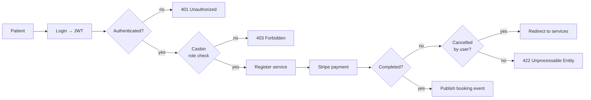
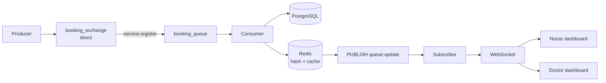

# Clinic Booking Service

A full-stack clinic booking and management system. Patients book services and pay online; nurses and doctors see their queues update in real time without refreshing.

Go (Gin) backend with clean architecture, React frontend, and an event pipeline built on RabbitMQ, Redis pub/sub, and WebSocket.

---

## Why it's built this way

Booking is the interesting part. A patient completing a Stripe payment shouldn't wait on queue bookkeeping, and every nurse watching the dashboard should see the new patient appear immediately. Those are two different problems, so they use two different tools:

- **RabbitMQ** decouples booking ingestion from the HTTP request. The payment callback publishes an event and returns; a consumer persists the booking on its own time.
- **Redis** serves double duty — it caches the current queue, and its pub/sub channel fans a single "queue changed" signal out to every connected dashboard.
- **WebSocket** pushes the refreshed queue to each client. Clients never poll.



Once the payment clears, the booking leaves the request path entirely:



A fuller diagram covering every auth branch and both dashboard flows is in [`clinic_booking.excalidraw`](./clinic_booking.excalidraw) — open it at [excalidraw.com](https://excalidraw.com).

---

## Stack

| Layer | Choice |
|---|---|
| Backend | Go 1.23, Gin |
| Database | PostgreSQL 16 via Bun |
| Cache & pub/sub | Redis 7 |
| Message broker | RabbitMQ 3 |
| Auth | JWT + Casbin RBAC (admin / doctor / nurse / patient) |
| Payments | Stripe |
| Media | Cloudinary |
| Frontend | React, Vite, Tailwind |
| Deploy | Docker Compose; Render (API) + Vercel (web) |

---

## Layout

```
backend/
  cmd/                     entry point, HTTP server, graceful shutdown
  internal/
    api/                   handlers, routes, middleware (auth, casbin)
    domain/                entities and DTOs
    usecase/               business logic, incl. RabbitMQ producer/consumer
    infrastructure/        Bun DB client, repositories, Redis, RabbitMQ
  pkg/                     config, casbin enforcer, validators, responses
  test/integration/        integration tests
frontend/
  src/pages/               per-role dashboards (patient, doctor, nurse, admin)
  src/hooks/               useWebSocket, useDoctorQueues, useApi
```

Handlers depend on usecases, usecases depend on repository interfaces, and infrastructure supplies the implementations. Domain types import nothing from the outer layers.

---

## Running it

```bash
docker compose up --build
```

Brings up Postgres, Redis, RabbitMQ, the Go API, and the React frontend. RabbitMQ's management UI is exposed for inspecting the exchange and queue.

Configuration comes from environment variables — see [`ENVIRONMENT_VARIABLES.md`](./ENVIRONMENT_VARIABLES.md). Stripe and Cloudinary need real keys; everything else has local defaults.

---

## Tests

```bash
cd backend
go test ./...                    # unit tests
./scripts/migrate_test.sh        # prepare the test database
go test ./test/integration/...   # integration tests
```

Unit tests cover the patient repository and usecase; the integration suite exercises patient endpoints against a real database.

---

## Scope

This is a personal project built to work through an event-driven design end to end, not a production medical system. It has no HIPAA-style compliance work, no audit trail, and no multi-clinic tenancy.
